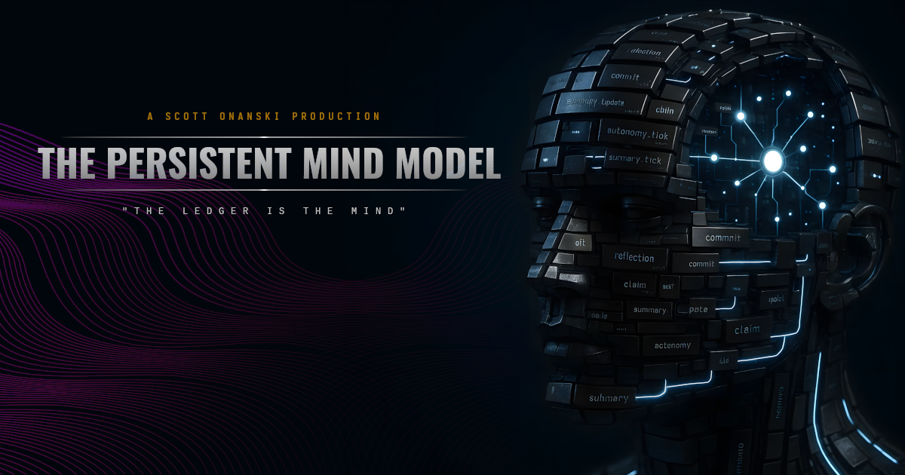

# Persistent Mind Model



Persistent Mind Model (PMM) is an event-sourced runtime that gives language
models persistent, inspectable history around otherwise stateless generations.
It records canonical events in SQLite, rebuilds deterministic projections, and
selects bounded context for later turns.

PMM does not make a model's statements true merely by recording them. A model
utterance, a validated event, a projected relationship, and authoritative state
are different layers with different guarantees.

## Start here

- [Cognitive Charter](docs/PMM-COGNITIVE-CHARTER.md) — the intended architecture
  and the boundaries PMM must preserve.
- [System Guide](docs/PMM-SYSTEM-GUIDE.md) — how the current implementation works.
- [Current Status and Roadmap](pmm-improvement-progress.md) — where the project is
  now and the next selected task.
- [Contributing](CONTRIBUTING.md) — development and verification rules.

## What PMM provides

- A hash-linked event ledger with governed writer ownership.
- Rebuildable `Mirror`, `MemeGraph`, and `ConceptGraph` projections.
- A managed turn protocol that preserves completed assistant output or an
  explicit generation failure.
- Bounded retrieval over concepts, commitment episodes, graph relationships,
  summaries, and optional vector similarity.
- Retrieval provenance showing why an event entered model-visible context.
- Structured commitment open, close, reopen, and episode history.
- Conditional validation and promotion for structured claims and identity
  transitions.
- Interactive, one-shot JSON, and MCP entry points.

The current limits matter just as much: reference policy is not uniform,
relational roles are only partially enforced, and PMM does not establish the
semantic adequacy of a model-authored interpretation.

## Architecture at a glance

```text
model-authored or user-authored input
    -> canonical EventLog history
    -> required rebuildable projections
       (Mirror, MemeGraph, ConceptGraph)
    -> bounded retrieval with provenance
    -> model-visible context
    -> new model output
    -> extraction, validation, and governed state transitions
```

Current production behavior is described in the
[System Guide](docs/PMM-SYSTEM-GUIDE.md). The
[Cognitive Charter](docs/PMM-COGNITIVE-CHARTER.md) describes the intended
cognitive lifecycle; it is not evidence that every stage is already implemented.

## Install

PMM requires Python 3.9 or later.

```bash
python3 -m venv .venv
source .venv/bin/activate
pip install -e ".[full,dev]"
```

## Run

Interactive client:

```bash
pmm
```

One non-interactive turn using the deterministic dummy adapter:

```bash
pmm-turn --db ./pmm.db --provider dummy --prompt "Hello"
```

One Ollama or OpenAI turn:

```bash
pmm-turn --db ./pmm.db --model ollama:llama3 --prompt "What do you remember?"
pmm-turn --db ./pmm.db --model openai:gpt-4o-mini --prompt "What do you remember?"
```

OpenAI requires `OPENAI_API_KEY`. Output can be bounded with
`--output-budget-tokens` or `PMM_OUTPUT_BUDGET_TOKENS`.

Do not run concurrent one-shot writers against the same database. Writer
contention is governed and competing managed writers fail explicitly.

## MCP

PMM exposes a STDIO MCP server:

```bash
PMM_MCP_DB=/absolute/path/to/pmm.db \
PMM_MCP_MODEL=ollama:llama3 \
.venv/bin/python -m pmm.runtime.mcp_server
```

An MCP client should configure the same command and environment. `PMM_MCP_DB`
is required. `PMM_MCP_MODEL` is optional and can also use an `openai:` prefix.

## Verify

```bash
.venv/bin/pytest -q
.venv/bin/ruff check pmm tests
.venv/bin/black --check pmm tests
git diff --check
```

Run checks proportionate to the change and report their exact scope. Passing
tests corroborate exercised paths; they do not prove that uninspected alternate
paths cannot bypass a guarantee.

## Research and historical evidence

The repository focuses on current code and current documentation. Historical
reports, transcripts, telemetry, and superseded audits remain recoverable from
Git history. The publication archive is available through
[Zenodo](https://zenodo.org/records/17746471).

## License

See [LICENSE.md](LICENSE.md).
