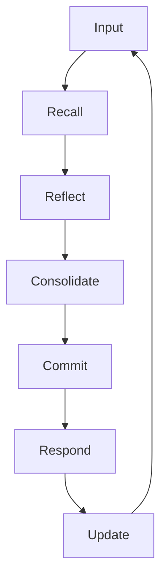
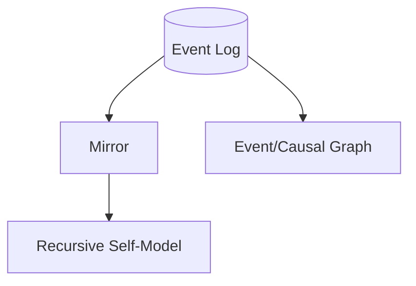

[README](../README.md) > Architecture

# PMM Architecture

## What PMM Is
The Persistent Mind Model (PMM) is an event‑sourced architecture that treats an agent’s mind as an append‑only, hash‑chained ledger of timestamped events. The runtime is deterministic with respect to state: given the same event log, PMM’s in‑memory mirror and projections reconstruct the same identity, open commitments, traits, and summaries. Text outputs from an LLM may be stochastic; when the model, parameters, seeds, prompts, and tool I/O are logged, they are reproducible as well. PMM’s design makes reasoning auditable and replayable instead of opaque.


## Guarantees, Invariants, Non‑Goals

### Guarantees
- Persistence: every decision output (messages, commitments, reflections, retrieval selections, summaries, metrics) is appended to the event log and recoverable for replay.
- Model-agnosticism: adapters allow use of different LLMs (local or hosted) without changing PMM’s core.
- Identity continuity: the self-model evolves from history and never “resets” silently.
- Exportability: the canonical store is a standard SQLite file that can be backed up, migrated, or inspected.
- Replayable state: mirror and projection state are pure functions of the log; replays converge to the same state.
- No full‑ledger scans on each turn in the interactive path; user turns rely on bounded tail reads, with full scans reserved for startup, background autonomy, and explicit diagnostics.
- Explicit ledger/context separation: every turn makes the distinction between the **ledger so far** (e.g., "Ledger so far: events 1..N (total N)") and the **retrieval window this turn** (e.g., "Retrieval window this turn: events A..B (K events selected)"), with only that small selected set forming the model’s active context.

### Invariants
- No hidden state: durable decisions are captured in the event log; intermediate scoring happens in memory but the resulting choices are persisted.
- Truth-first discipline: deterministic prompts and structured claim checks steer outputs toward ledger-grounded statements, but factual accuracy still depends on inputs and adapter compliance.
- Full reconstructability: the agent’s behavior is explainable from the causal chain of events.

### Non‑Goals
- Sentience or unconstrained autonomy.
- Open‑ended long‑term planning beyond explicit commitments.
- Opaque fine‑tuning of LLMs or private PII brokerage.


## Conceptual Model

- Event Log (Ledger): append‑only, hash‑chained record of everything the agent perceives or does.
- Mirror: in‑memory replay that derives current state (identity traits, open commitments/goals, summaries, retrieval config) from the log. Optionally includes RSM (Recursive Self-Model) support when enabled.
- Runtime Loop: the turn engine that reads state, runs retrieval, invokes the model, parses control markers, and appends new events.
- Autonomy Kernel & Supervisor: a slot‑based background loop (`AutonomyKernel` + `AutonomySupervisor`) that emits `autonomy_stimulus` and `autonomy_tick` events, maintains ledger‑backed thresholds and policies, and triggers reflection/summary/indexing cycles.
- Recursive Self‑Model (RSM): reflection layer that summarizes tendencies, knowledge gaps, and interaction patterns; updated by replay via Mirror.
- Event Graph (aka MemeGraph): causal links between events (e.g., replies_to, commits_to, closes, reflects_on), keeping threads traceable over time. When vector retrieval is active, the resulting graph statistics may appear in the system prompt so the model is aware of structural context (see [MemeGraph Visibility](05-MEMEGRAPH-VISIBILITY.md)).
- Concept Token Layer (CTL): a concept graph built purely from ledger events over semantic tokens (e.g., identity, policy, governance, topic concepts). CTL has **no built‑in static ontology**; concepts exist only when ledger events (from the model, scripts/tools, or the autonomy kernel) introduce tokens via `concept_define`, `concept_bind_event`, `concept_bind_thread`, or `concept_relate`. Thread bindings attach concepts directly to commitment CIDs, allowing CTL to refer to *stories* (threads) as well as individual events. CTL is maintained incrementally in the runtime loop and is fully rebuildable on demand for context rendering. It is used to track high‑level notions like system maturity, autonomy behavior, and governance threads.

Entities derived from replay:
- Belief: derived knowledge/convictions reconstructed from events and summaries.
- Memory (Events/Episodes): events themselves are memory; short windows or retrieved subsets form working context.
- Goal (Commitment): explicit intentions with lifecycle: `commitment_open` → `commitment_close`.
- Trait: stable tendencies inferred from history (e.g., emphasis patterns) that evolve transparently.
- Episode: a recent window assembled for the next turn’s context.
- Reflection: concise self‑summaries capturing what changed, conflicts, and next focus.


## Turn Lifecycle

Input → Recall → Reflect → Consolidate → Commit → Respond → Update



- Input: append the user’s message as `user_message` to the SQLite‑backed EventLog with hash chaining.
- Recall: run a deterministic **Hybrid Retrieval pipeline** (`RetrievalConfig` + `run_retrieval_pipeline`) that seeds concepts from CTL (including `concept_bind_thread` bindings), expands relevant commitment threads via MemeGraph into bounded “story” windows, optionally refines the selection with local vector search, and renders a four‑section context (Concepts, Threads, State/Self‑Model, Evidence) alongside an RSM snapshot via `render_context`.
- Reflect: inside the same model call, the LLM reasons over this context (including prior reflections and summaries). After the reply is logged, `synthesize_reflection` appends a JSON `reflection` event summarizing intent, outcome, internal goals, and (when enough data exists) an RSM + graph summary, all derived from the ledger.
- Consolidate: periodic consolidation steps (`summary_update` via `maybe_append_summary` and `lifetime_memory` via `maybe_append_lifetime_memory`) compress identity and history into replay checkpoints and long‑range memory chunks without losing evidence links.
- Commit: parse protocol markers (`COMMIT:`, `CLOSE:`, `CLAIM:`, `REFLECT:`) deterministically; open/close commitments via `CommitmentManager`, validate claims against ledger state, and accumulate a `TurnDelta` for any deltas (opens, closes, failed claims, REFLECT blocks).
- Respond: store the full `assistant_message` (including markers and optional structured JSON header) in the ledger; user‑facing UIs may hide markers, but they remain available for replay and analysis.
- Update: append `metrics_turn`, `retrieval_selection` (with provenance digest when vector is enabled), reflections from `TurnDelta` when non‑empty, and any summaries/memory chunks. Mirror, MemeGraph, ConceptGraph, and autonomy listeners update their projections incrementally via `register_listener`.


## Determinism and Reproducibility

- State determinism: mirror state is a pure function of the event log; given the same log, replay yields the same goals, traits, and summaries.
- Text determinism (optional): capture `model` identifier/version, generation parameters (e.g., temperature, top_p, seed), full prompts (system/tools/few‑shot), and tool I/O. With these fixed and available, text outputs can be reproduced.
- Without seeds or with different model binaries, PMM still replays to the same state and justifications (corrections, commitments, summaries).


## Persistence and Storage

- Backend: SQLite database (default path typically `.data/pmmdb/pmm.db`).
- Append‑only: no deletes/overwrites; writes are guarded by a lock for atomicity.
- Hash chain: each event includes `prev_hash` and `hash` computed over the canonical JSON payload to ensure integrity.
- Inter‑ledger references: `REF: <path>#<event_id>` markers (or `refs` arrays in reflections) are turned into `inter_ledger_ref` events whose metadata records the referenced event’s hash when it can be verified, keeping cross‑ledger links auditable.

Minimal event schema (illustrative):
```json
{
  "id": 12345,
  "ts": "2025-11-08T12:34:56.789Z",
  "kind": "assistant_message",
  "content": "... raw text including markers ...",
  "meta": { "model": "gpt-4o", "temperature": 0.2, "seed": 42 },
  "prev_hash": "…",
  "hash": "…"
}
```


## Marker Protocol (Assistant Output Grammar)

Lines in assistant outputs may include structured markers, parsed deterministically:
- `COMMIT: <title>` — open a commitment with deterministic ID.
- `CLOSE: <CID>` — close a commitment by ID.
- `CLAIM:<type>=<json>` — structured claim with a type key and JSON payload (validated later).
- `REFLECT:<json>` — structured introspective note encoded as JSON; used to build a per‑turn `TurnDelta` reflection.
- `REF: <path>#<event_id>` — optional cross‑ledger reference; parsed into `inter_ledger_ref` events and verified against the target ledger when available.

Parsing is line‑oriented; markers are case‑sensitive and must start a line. Non‑marker text is the natural language reply.


## Algorithms and Policies

- Retrieval: a **Hybrid Concept‑Graph pipeline** is seeded as the default strategy (the `AutonomyKernel` appends a `config` event with `type="retrieval"`). The pipeline always uses CTL concepts and MemeGraph threads as seeds; when `strategy == "vector"`, it adds deterministic vector search on top. When embeddings are absent or `strategy == "fixed"`, retrieval still uses CTL + MemeGraph + recency but skips vector scoring, preserving determinism and replayability.
- Retrieval provenance: every turn with vector retrieval appends a `retrieval_selection` event whose content includes selected ids, scores, model, dims, and a `selection_digest`. CLI commands such as `/pm retrieval last` and `/pm retrieval verify <turn_id>` surface these events for audit without mutating the ledger.
- Reflection cadence: after each assistant reply, `synthesize_reflection` appends a JSON `reflection` event summarizing the turn (intent, outcome, internal goals, and, when available, an RSM + graph snapshot) purely from ledger state. A second, human‑readable `reflection` is appended only when `TurnDelta` is non‑empty (new commitments, closures, failed claims, or a REFLECT block). `summary_update` events are appended by `maybe_append_summary` when thresholds are met (≥3 reflections since the last summary, >10 events, or significant RSM change), and `lifetime_memory` chunks are emitted by `maybe_append_lifetime_memory` as the ledger grows.
- Belief consolidation: open/close commitments update active goals; validated claims are persisted as `claim` events and auto‑bound into CTL; stable tendencies and knowledge gaps are tracked by the RSM.
- Conflict surfacing: failed claims are called out in delta reflections so discrepancies remain visible; the hash chain prevents tampering with underlying evidence.
- Safety rails: durable changes flow through the log; ledger‑backed policy config prevents disallowed writers from touching sensitive kinds (`config`, `checkpoint_manifest`, `embedding_add`, `retrieval_selection`), and violations are logged as explicit events instead of failing silently.


## APIs and Hooks

- EventLog API: `append(...)`, `read_all()`, `read_tail(n)`, and `register_listener(fn)` for reactive components like Mirror, MemeGraph, ConceptGraph, and the autonomy kernel.
- Commitment Manager: `open_commitment(text, source)` generates a deterministic CID and appends `commitment_open`; `close_commitment(cid)` appends `commitment_close`; queries like `get_open_commitments(...)` derive state by replay.
- CID derivation for assistant/user commitments: `cid = sha1(text)[:8]` (hex); internal autonomy commitments use deterministic IDs generated via `generate_internal_cid` (e.g., `mc_000123`).
- Runtime Loop: `run_turn(user_input)` executes the full cycle: log input, run retrieval, build context, invoke the model adapter, parse markers, append metrics/reflection/summary/memory events, and update projections.
- Autonomy Kernel: `decide_next_action()` inspects ledger projections and returns a deterministic `KernelDecision` (reflect/summarize/index/idle); `RuntimeLoop.run_tick(...)` logs an `autonomy_tick`, executes the action (including `synthesize_reflection`, `maybe_append_summary`, or indexer runs), emits `outcome_observation`, and updates stability/coherence/meta‑policy metrics.
- Prompt contracts: a deterministic system primer enforces protocol (“respond truthfully; don’t invent data; use markers when committing/claiming/reflecting”).
- Hooks/events: listeners respond to new events (e.g., autonomy stimuli/ticks, causal graph updates, metrics aggregation, CTL maintenance).


## Error Handling and Idempotency

- Idempotency: dedup by event hash is enforced via a UNIQUE index on `events.hash` (INSERT OR IGNORE), keeping appends deterministic and replayable.
- Partial failures: the runtime appends explicit error or correction events; it never rewrites history.
- Tool/adapter errors: captured in event metadata or as dedicated error events for later diagnosis.


## Privacy and Security

- Storage: SQLite is portable; optional OS‑level encryption or database‑level encryption can be applied.
- Secrets: keep API keys out of the ledger; store them in environment or secure stores; redact in reflections/summaries when necessary.
- Redaction policy: reflections and summaries should avoid copying sensitive user content verbatim unless required for function.


## Performance and Maintenance

- Checkpoints: `summary_update` events act as replay checkpoints for faster boot.
- Compaction: shipped `checkpoint_manifest` + `summary_update` with root_hash verification.
- Indexing: add indices on `(kind, ts)` and hashes for large ledgers; keep derived indices in memory via the mirror and event graph.


## Configuration Knobs

- Context window (recall limit), reflection thresholds, autonomy timing, and storage backends.
- Model adapter, model name, and generation parameters via environment variables or config.
- Profiles: lightweight vs deep (smaller vs larger context) depending on device constraints.


## Example End‑to‑End

User Input: “I want to plan a trip to Paris next month.”

1) Input
- Append: `user_message` with the user text.

2) Recall
- Run the Hybrid Retrieval pipeline to gather a bounded, concept‑seeded window of prior events (threads, summaries, lifetime memory) and render the four‑section context (Concepts, Threads, State/Self‑Model, Evidence) plus an RSM snapshot.

3) Reflect/Plan
- Model decides to open a travel‑booking commitment and reply succinctly.

4) Respond (with marker)
```
COMMIT: Book flights to Paris
Sure — I’ll look into flight options for your dates.
```

5) Commit
- Parse `COMMIT:`; `open_commitment("Book flights to Paris")` generates CID (e.g., `a1b2c3d4`) and appends `commitment_open`.

6) Update
- Append `assistant_message`, `metrics_turn` (timing/tokens), and `reflection` summarizing the change (e.g., “Opened commitments: a1b2c3d4.”). If thresholds are met, append `summary_update`.

Result
- The ledger now contains a causally complete trail: `user_message` → `assistant_message` (+ marker) → `commitment_open` → `metrics_turn` → one or more `reflection` events (plus periodic `summary_update` and `lifetime_memory` as thresholds are hit). Replay reconstructs the same open commitments and identity summaries even if text isn’t byte‑identical without seeds.


## Diagrams (Optional)

Flow


Data



## Notes
- This document describes the architecture and runtime guarantees. Exact class and method names may vary slightly in code; when they differ, prefer consistent terminology: Event Log, Mirror, Runtime Loop, Recursive Self‑Model, Event Graph.
- Replace or extend retrieval and reflection policies as your use case grows; PMM’s invariants (append‑only, replayable state, truth‑first) should remain constant.


[TOP](#persistent-mind-model-pmm)

[PREV: Introduction](01-Introduction-to-the-Persistent-Mind-Model.md)

[NEXT: Why PMM Matters](03-WHY-PMM-MATTERS.md)

[BACK TO README](../README.md)
