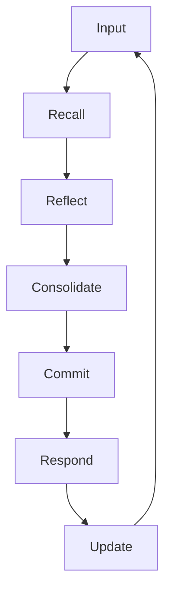
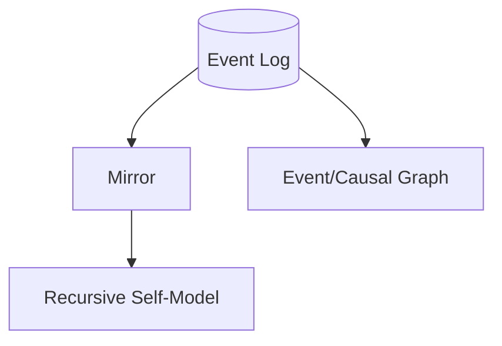

[README](../README.md) > Architecture

# PMM Architecture

## What PMM Is
The Persistent Mind Model (PMM) is an event‑sourced architecture that treats an agent’s mind as an append‑only, hash‑chained ledger of timestamped events. The runtime is deterministic with respect to state: given the same event log, PMM’s in‑memory mirror reconstructs the same identity, open commitments, traits, and summaries. Text outputs from an LLM may be stochastic; when the model, parameters, seeds, prompts, and tool I/O are logged, they are reproducible as well. PMM’s design makes reasoning auditable and replayable instead of opaque.


## Guarantees, Invariants, Non‑Goals

### Guarantees
- Persistence: every decision output (messages, commitments, reflections, retrieval selections, summaries, metrics) is appended to the event log and recoverable for replay.
- Model-agnosticism: adapters allow use of different LLMs (local or hosted) without changing PMM’s core.
- Identity continuity: the self-model evolves from history and never “resets” silently.
- Exportability: the canonical store is a standard SQLite file that can be backed up, migrated, or inspected.
- Replayable state: mirror state is a pure function of the log; replays converge to the same state.

### Invariants
- No hidden state: durable decisions are captured in the event log; intermediate scoring happens in memory but the resulting choices are persisted.
- Truth-first discipline: deterministic prompts and structured claim checks steer outputs toward ledger-grounded statements, but factual accuracy still depends on inputs and adapter compliance.
- Full reconstructability: the agent’s behavior is explainable from the causal chain of events.

### Non‑Goals
- Sentience or unconstrained autonomy.
- Open‑ended long‑term planning beyond explicit commitments.
- Opaque fine‑tuning of LLMs or private PII brokerage.


## Conceptual Model

- Event Log (Ledger): append‑only, hash‑chained record of everything the agent perceives or does.
- Mirror: in‑memory replay that derives current state (identity traits, open commitments/goals, summaries) from the log. Optionally includes RSM (Recursive Self-Model) support when enabled.
- Runtime Loop: the turn engine that reads state, invokes the model, applies policies, and appends new events.
- Recursive Self‑Model (RSM): reflection layer that summarizes tendencies, knowledge gaps, and identity; updated by replay.
- Event Graph (aka MemeGraph): causal links between events (e.g., replies_to, comments_on, closes), keeping threads traceable over time. When vector retrieval is active, the resulting graph statistics may appear in the system prompt so the model is aware of structural context (see [MemeGraph Visibility](05-MEMEGRAPH-VISIBILITY.md)).
- Concept Token Layer (CTL): a concept graph built over semantic tokens (e.g., identity, policy, governance, topic concepts) that are automatically defined once per ledger and bound to events by the autonomy loop. CTL is fully rebuildable from `concept_define`, `concept_bind_event`, and `concept_relate` events and is maintained incrementally in the runtime loop while remaining rebuildable on demand for context rendering. It is used to track high‑level notions like system maturity, autonomy behavior, and governance threads.

Entities derived from replay:
- Belief: derived knowledge/convictions reconstructed from events and summaries.
- Memory (Events/Episodes): events themselves are memory; short windows or retrieved subsets form working context.
- Goal (Commitment): explicit intentions with lifecycle: `commitment_open` → `commitment_close`.
- Trait: stable tendencies inferred from history (e.g., emphasis patterns) that evolve transparently.
- Episode: a recent window assembled for the next turn’s context.
- Reflection: concise self‑summaries capturing what changed, conflicts, and next focus.


## Turn Lifecycle

Input → Recall → Reflect → Consolidate → Commit → Respond → Update



- Input: append the user’s message as `user_message`.
- Recall: reconstruct a short working history (fixed window or vector retrieval) and the current open commitments; surface an RSM snapshot.
- Reflect (Plan): the model performs iterated self‑evaluation based on current goals, traits, and context.
- Consolidate: validate planned assertions against mirror state; stage corrections for conflicts.
- Commit: parse protocol markers to open/close commitments deterministically.
- Respond: append `assistant_message` with any `COMMIT/CLAIM/REFLECT` lines.
- Update: append `metrics_turn`, `reflection`, and (if thresholds met) `summary_update` events; listeners update mirror and event graph.


## Determinism and Reproducibility

- State determinism: mirror state is a pure function of the event log; given the same log, replay yields the same goals, traits, and summaries.
- Text determinism (optional): capture `model` identifier/version, generation parameters (e.g., temperature, top_p, seed), full prompts (system/tools/few‑shot), and tool I/O. With these fixed and available, text outputs can be reproduced.
- Without seeds or with different model binaries, PMM still replays to the same state and justifications (corrections, commitments, summaries).


## Persistence and Storage

- Backend: SQLite database (default path typically `.data/pmmdb/pmm.db`).
- Append‑only: no deletes/overwrites; writes are guarded by a lock for atomicity.
- Hash chain: each event includes `prev_hash` and `hash` computed over the canonical JSON payload to ensure integrity.
- Inter‑ledger references: events may reference external ledgers using verifiable references.

Minimal event schema (illustrative):
```json
{
  "id": 12345,
  "ts": "2025-11-08T12:34:56.789Z",
  "kind": "assistant_message",
  "content": "... raw text including markers ...",
  "meta": { "model": "gpt-4o", "temperature": 0.2, "seed": 42 },
  "prev_hash": "…",
  "hash": "…"
}
```


## Marker Protocol (Assistant Output Grammar)

Lines in assistant outputs may include structured markers, parsed deterministically:
- `COMMIT: <title>` — open a commitment with deterministic ID.
- `CLOSE: <CID>` — close a commitment by ID.
- `CLAIM:<type>=<json>` — structured claim with a type key and JSON payload (validated later).
- `REFLECT:<json>` — structured introspective note encoded as JSON; used to build a `reflection` event.

Parsing is line‑oriented; markers are case‑sensitive and must start a line. Non‑marker text is the natural language reply.


## Algorithms and Policies

- Retrieval: vector retrieval is seeded as the default strategy (`autonomy_kernel` appends the config). If no vector data is available, the runtime falls back to fixed-window recall alongside the RSM snapshot.
- Reflection cadence: synthesize a `reflection` whenever commitments open/close, claims fail validation, or a REFLECT block appears. Append `summary_update` when thresholds are met (≥3 reflections since the last summary, >10 events) or when the RSM shows significant change.
- Belief consolidation: open/close commitments update active goals; stable tendencies and knowledge gaps update the RSM.
- Conflict surfacing: failed claims are called out in reflections so discrepancies remain visible; the hash chain prevents tampering.
- Safety rails: durable changes flow through the log; policy enforcement blocks disallowed writers; errors surface as ledger events instead of silent failure.


## APIs and Hooks

- EventLog API: `append(...)`, `read_all()`, `read_tail(n)`, and `register_listener(fn)` for reactive components like the mirror and event graph.
- Commitment Manager: `open_commitment(text, source)` generates a deterministic CID and appends `commitment_open`; `close_commitment(cid)` appends `commitment_close`; queries like `get_open_commitments(...)` derive state by replay.
- CID derivation for assistant/user commitments: `cid = sha1(text)[:8]` (hex); internal autonomy commitments use deterministic IDs generated via `generate_internal_cid` (e.g., `mc_000123`).
- Runtime Loop: `run_turn(user_input)` executes the full cycle: log input, build context, invoke model, parse markers, append metrics/reflection/summary, and update listeners.
- Prompt contracts: a deterministic system primer enforces protocol (“respond truthfully; don’t invent data; use markers when committing/claiming/reflecting”).
- Hooks/events: listeners respond to new events (e.g., autonomy ticks, causal graph updates, metrics aggregation).


## Error Handling and Idempotency

- Idempotency (recommended): dedup by event hash is a recommended policy; the current database schema does not enforce a UNIQUE constraint yet.
- Partial failures: the runtime appends explicit error or correction events; it never rewrites history.
- Tool/adapter errors: captured in event metadata or as dedicated error events for later diagnosis.


## Privacy and Security

- Storage: SQLite is portable; optional OS‑level encryption or database‑level encryption can be applied.
- Secrets: keep API keys out of the ledger; store them in environment or secure stores; redact in reflections/summaries when necessary.
- Redaction policy: reflections and summaries should avoid copying sensitive user content verbatim unless required for function.


## Performance and Maintenance

- Checkpoints: `summary_update` events act as replay checkpoints for faster boot.
- Compaction: optional future policy to snapshot and prune raw tails while preserving hashes/roots for audit.
- Indexing: add indices on `(kind, ts)` and hashes for large ledgers; keep derived indices in memory via the mirror and event graph.


## Configuration Knobs

- Context window (recall limit), reflection thresholds, autonomy timing, and storage backends.
- Model adapter, model name, and generation parameters via environment variables or config.
- Profiles: lightweight vs deep (smaller vs larger context) depending on device constraints.


## Example End‑to‑End

User Input: “I want to plan a trip to Paris next month.”

1) Input
- Append: `user_message` with the user text.

2) Recall
- Gather the last few messages (or none) and RSM snapshot.

3) Reflect/Plan
- Model decides to open a travel‑booking commitment and reply succinctly.

4) Respond (with marker)
```
COMMIT: Book flights to Paris
Sure — I’ll look into flight options for your dates.
```

5) Commit
- Parse `COMMIT:`; `open_commitment("Book flights to Paris")` generates CID (e.g., `a1b2c3d4`) and appends `commitment_open`.

6) Update
- Append `assistant_message`, `metrics_turn` (timing/tokens), and `reflection` summarizing the change (e.g., “Opened commitments: a1b2c3d4.”). If thresholds are met, append `summary_update`.

Result
- The ledger now contains a causally complete trail: `user_message` → `assistant_message` (+ marker) → `commitment_open` → `metrics_turn` → `reflection`. Replay reconstructs the same open commitments and identity summaries even if text isn’t byte‑identical without seeds.


## Diagrams (Optional)

Flow


Data



## Notes
- This document describes the architecture and runtime guarantees. Exact class and method names may vary slightly in code; when they differ, prefer consistent terminology: Event Log, Mirror, Runtime Loop, Recursive Self‑Model, Event Graph.
- Replace or extend retrieval and reflection policies as your use case grows; PMM’s invariants (append‑only, replayable state, truth‑first) should remain constant.


[TOP](#persistent-mind-model-pmm)

[PREV: Introduction](01-Introduction-to-the-Persistent-Mind-Model.md)

[NEXT: Why PMM Matters](03-WHY-PMM-MATTERS.md)

[BACK TO README](../README.md)
