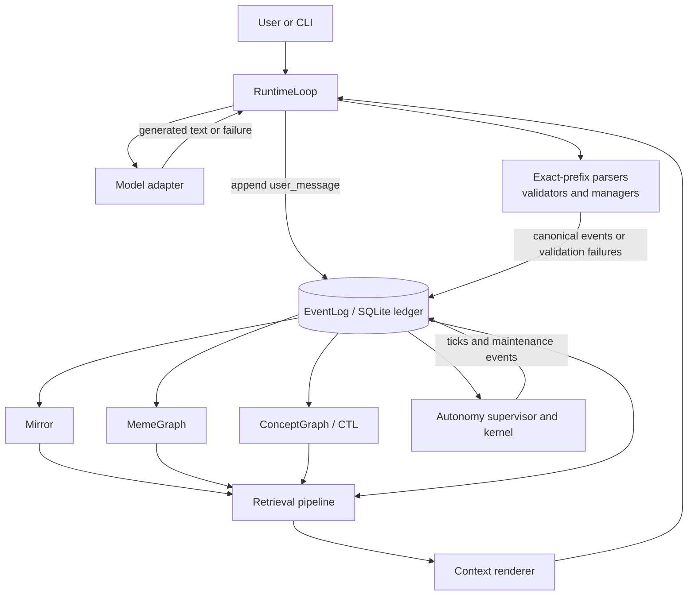

# PMM System Guide

This is the plain-language guide to the Persistent Mind Model as it exists in the repository today. It was checked against production code at commit `adf3e57df35f8141b9a88f72e6be0b548286b18e`.

It explains what PMM does, how its parts fit together, and where its present guarantees stop. It is not a statement that every recorded claim is true, every relationship is semantically justified, or every planned integrity rule has been implemented.

## What PMM is now

PMM is a persistent runtime around a language model. It records a conversation and the system activity around it in a SQLite event ledger, derives useful working views from that ledger, retrieves a bounded selection of prior material for each new turn, and gives that material to the next model call.

The language model still generates the words. PMM supplies continuity around those generations:

- what the user and assistant previously said;
- which structured statements passed the validator that handled them;
- which commitments are currently open;
- which events, concepts, and commitment threads are connected;
- which earlier events were selected for the current turn;
- which summaries, reflections, and operational decisions were recorded.

The most useful mental model is:

```text
persisted events
    -> validated typed events
    -> rebuildable projections
    -> bounded retrieval
    -> model-visible context
    -> a new response and new events
```

These stages must remain separate. A model utterance is history, not automatically a fact. A typed event means a production path accepted a structure under its current rules, not that its meaning is universally true. A graph edge is a deterministic relationship recorded or inferred by code, not proof of semantic relevance.

## The current architecture



The arrows into `Mirror`, `MemeGraph`, and `ConceptGraph` represent deterministic observation of ledger events. Those components do not replace the ledger. They have rebuild paths, although normal runtime startup currently rebuilds `Mirror` and `ConceptGraph` but not the existing `MemeGraph` history. That restart boundary is described under current gaps.

## What happens during a normal turn

The production path is `RuntimeLoop.run_turn` in [`pmm/runtime/loop.py`](../pmm/runtime/loop.py).

1. **The user message is persisted.** The runtime appends a `user_message` event. Managed turns use the terminal-outcome protocol so that this user event can have one linked `assistant_message` or `generation_failure`.

2. **PMM prepares retrieval.** The runtime reads the current retrieval configuration, a recent ledger tail, projected open commitments, and concept tokens found in the user query. It asks the retrieval pipeline for a bounded set of prior event IDs. The recent tail's contents are not automatically inserted as a sliding conversation window; prior content must be selected by retrieval to appear as raw evidence.

3. **Retrieval combines several views.** The pipeline can select concept-bound events, commitment-thread slices, graph neighbors, lifetime-memory records, and vector refinements over eligible candidates. It merges them in stable ledger order and retains selection provenance. Selection means “made available to this turn,” not “proved relevant or true.”

4. **The selected state is rendered.** The context renderer turns the result into model-readable sections for concepts, threads, graph structure, state information, optional self-model information, retrieval provenance, and raw event evidence. The normal system prompt and the new user input are added.

5. **The model adapter is called.** A complete generation proceeds to semantic processing. A transport error or incomplete generation becomes a linked `generation_failure` and does not reach commitment, claim, closure, or reflection parsers.

6. **The assistant utterance is preserved first.** PMM appends the complete response as the turn's `assistant_message`. An optional first-line JSON object may declare structured response fields, evidence designations, active concepts, or concept operations. Invalid evidence designations produce a `validation_failure`; they do not erase the assistant's words.

7. **The turn is indexed.** The user and assistant events are bound to active concepts. If the model declared none, the runtime currently applies a continuity fallback. Structured concept operations may create additional concept events. When configured, embeddings are also recorded.

8. **Retrieval and runtime diagnostics are recorded.** A `retrieval_selection` event preserves selected IDs, scores, provenance, and a digest. A `metrics_turn` event records prompt/output measurements and adapter diagnostics.

9. **Deterministic maintenance runs.** The runtime may synthesize a reflection, update a summary, or create a lifetime-memory record according to the applicable thresholds.

10. **Structured lines are interpreted.** Exact-prefix parsers inspect the already-preserved assistant response:

    - `COMMIT:` lines are passed to the commitment manager and may create `commitment_open` events.
    - `CLAIM:type=JSON` lines are validated. Passing claims become canonical `claim` events and receive concept bindings; rejected claims produce `validation_failure` events.
    - validated identity proposal and ratification claims may lead the identity manager to create an `identity_adoption` event when its ordered protocol is satisfied.
    - `CLOSE:<cid>` lines are passed through the authoritative commitment-close boundary.
    - a `REFLECT:` block contributes to a final turn-delta reflection when the turn changed structured state.

11. **Listeners update the live projections.** Every newly appended event is offered to the projections. Unsupported or malformed projection input may be ignored, depending on that projection's rules. `Mirror` automatically reads existing history and the runtime explicitly rebuilds `ConceptGraph`. `MemeGraph` is rebuildable, but normal `RuntimeLoop` initialization currently registers it only for new events without first replaying existing history.

The exact number and order of maintenance events between the assistant message and a commitment event can vary with configuration and ledger state. The lifecycle above describes the production control flow, not a promise that every turn has the same event count.

## The major components

| Component | What it does | What it does not establish |
|---|---|---|
| `EventLog` | Persists ordered events in SQLite, records `prev_hash` and `hash`, deduplicates identical hash payloads, and provides specialized atomic boundaries for managed turn outcomes and authoritative commitment closes. | It does not make arbitrary direct database edits impossible. Hash checks make chain damage detectable; they do not authenticate the semantic truth of event content. Generic append validation is not uniform across every event kind. |
| `RuntimeLoop` | Orchestrates one turn: persistence, retrieval, prompt assembly, generation, preservation, extraction, validation, projection-producing events, and diagnostics. | It does not turn model text into truth merely by recording it. |
| `Mirror` | Maintains fast projected state: open commitments, staleness flags, reflection counts, current retrieval configuration, and optionally the recursive self-model. | It is not primary history. A projection can ignore malformed or unresolved legacy events. |
| `MemeGraph` | Builds a directed event graph for replies, commitments, closes, identity adoption, reflections, and summaries. It supports thread and neighborhood retrieval and has an explicit full-rebuild method. | An edge records the code's relationship rule; it does not prove semantic adequacy. Some older or weaker relationships are inferred or silently absent. `RuntimeLoop` does not currently call the full rebuild when it opens an existing ledger. |
| `ConceptGraph` | Rebuilds the Concept Token Layer: concept definitions and versions, aliases, concept relations, event bindings, commitment-thread bindings, and attribution records. | It does not yet guarantee complete target, version, supersession, authorship, or relation governance across every producer. |
| `CommitmentManager` | Opens general and internal commitments, queries open state, and routes closures through the atomic EventLog transition. | General CID generation and duplicate-open governance are not fully resolved; that is the queued R07 policy surface. |
| Identity manager | Scans validated identity proposal and ratification claims and creates one adoption after an ordered intervening reflection or commitment lifecycle event. | The current protocol proves order and token agreement, not that the intervening anchor is semantically relevant to the proposed identity. |
| Retrieval pipeline | Selects bounded prior events using concepts, commitment threads, graph expansion, lifetime-memory records, and optional vector refinement; it records why events were selected. | Retrieval inclusion is not evidence quality, and omission is not proof of irrelevance. Limits can leave useful history out of a turn. |
| Autonomy supervisor and kernel | Schedules ledger-derived maintenance decisions such as reflecting, summarizing, and indexing, and records ticks, decisions, observations, and policy-related events. It uses the same ledger and commitment-close boundary. | It is not an independent source of semantic truth. Its decisions are only as strong as the events, projections, thresholds, and relationship checks it consumes. |

## What is authoritative

PMM has several kinds of authority, not one.

| Layer | Meaning |
|---|---|
| Utterance history | The ledger establishes that a user or model emitted the recorded content through the runtime path. The content can include failed, unsupported, or rejected assertions. |
| Extracted candidate | A parser recognized a structured form such as `COMMIT:`, `CLAIM:`, or `CLOSE:`. Recognition alone changes no canonical state. |
| Validation or manager decision | A named production mechanism accepted or rejected the candidate under its current checks. Different structures currently receive different levels of referential and relational validation. |
| Canonical typed event | A typed event records accepted structure or a successful state transition. Its authority is scoped to the guarantee of its producer. A `validation_failure` separately preserves a rejected promotion attempt. |
| Projection | `Mirror`, `MemeGraph`, and `ConceptGraph` provide the operational state used by retrieval and runtime decisions. They are derived and rebuildable, so the ledger remains the source from which they are reconstructed. |
| Model-visible context | Retrieval and rendering decide which persisted and projected material the next model call can see. Visibility can influence behavior, but it does not itself promote a claim or relationship. |

For example, a model can write `CLOSE:unknown`. The assistant event authoritatively preserves that attempted instruction as history. R08 now prevents it from becoming an authoritative `commitment_close` state transition.

## A commitment from opening to future recall and closure

The following is the verified R08 lifecycle in ordinary language.

```text
user asks
  -> retrieval builds context
  -> model response contains COMMIT
  -> full assistant response is preserved
  -> commitment_open is appended with a CID
  -> concept-to-event and concept-to-CID bindings support later retrieval
  -> a later turn retrieves the open state or thread
  -> model response contains CLOSE:<cid>
  -> full assistant response is preserved
  -> EventLog atomically resolves the latest open lifecycle event
  -> one commitment_close records cid, source, and exact open_event_id
  -> Mirror removes the CID from open state
  -> MemeGraph adds close -> open with label "closes"
  -> reopen and replay reconstruct the same closed state and edge
```

A fresh, disposable, on-disk runtime acceptance run exercised this path through four production `RuntimeLoop` turns. In that observed run:

- event `15` was the opening event;
- event `28` was the only canonical close;
- close event `28` recorded `open_event_id: 15` and its production source;
- a duplicate close attempt and an unknown-CID attempt still produced assistant-message history but no additional `commitment_close`;
- after fully closing and reopening the database, `Mirror` reconstructed the commitment as closed and `MemeGraph` reconstructed the exact `28 -> 15` `closes` edge;
- the repository's hash-chain, replay, and checkpoint checks passed for that database.

That run is direct local acceptance evidence for the exercised lifecycle. It does not broaden R08 into a duplicate-open policy, prove every semantic relationship in PMM, or authorize R07.

### Why closing is now different from merely saying “close”

For newly written history, a canonical `commitment_close` means that PMM performed a successful transition from the exact latest open event for that CID. An unknown CID creates no close. Repeating a close is idempotent and creates no second close. Generic `EventLog.append(kind="commitment_close", ...)` cannot bypass this boundary.

Legacy close events without `open_event_id` remain replayable. `MemeGraph` uses CID lookup as a compatibility fallback for those records. That compatibility behavior is historical preservation, not the rule for new authoritative closes.

## How information can affect future behavior

Persisting an event makes it available to later code, but it does not guarantee that every future prompt will contain it. Information affects a later turn through one or more of these routes:

- `Mirror` state, especially open commitments and the optional recursive self-model;
- concept bindings selected through `ConceptGraph`;
- commitment threads and neighboring events selected through `MemeGraph`;
- summary or lifetime-memory records;
- vector refinement over an eligible candidate set;
- autonomy decisions based on ledger and projection state.

The retrieval selection is itself recorded, including per-event reasons and scores. That makes it possible to ask “what did this turn receive?” It does not answer the harder semantic question “was this the best or sufficient evidence?”

## Current guarantees, in plain language

The current repository supports these bounded statements:

- Production EventLog writes create ordered, hash-linked records, and repository checks can detect a broken chain.
- A managed user turn has one protocol-linked terminal outcome: an assistant message or a generation failure.
- Incomplete or failed model generations do not reach semantic state parsers.
- Complete assistant responses are preserved before their structured contents are promoted or rejected.
- New commitment closes are mandatory successful transitions through one atomic boundary: the target CID must have a latest open lifecycle event, the exact open event is recorded, and repeats are idempotent.
- The three main projections have rebuild procedures over persisted events. The R08 acceptance run directly demonstrated the same commitment state and exact close edge after an explicit rebuild; normal runtime startup does not currently invoke every one of those procedures.
- When claim evidence references are supplied through the normal runtime claim path, their ID shape, ledger existence, and availability in that turn's retrieval selection are checked.
- Retrieval selections retain production provenance explaining how selected events entered the context set.

Each statement is scoped to the named production path. It should not be expanded into “all PMM memory is true,” “every reference is relationally valid,” or “the database cannot be altered outside PMM.”

## Current gaps and unsettled policy

These are active boundaries, not hidden guarantees:

- **R07 duplicate opens:** general commitment CIDs are derived from text, while generic append and projection behavior do not yet provide a repository-wide duplicate-CID policy. A later open with the same CID can replace the earlier one in `Mirror`'s open map. R08 closes the currently authoritative latest open; it does not resolve how duplicate opens should be governed.
- **MemeGraph after restart:** `RuntimeLoop` creates a new `MemeGraph` and listens for future events, but does not replay the existing ledger into it. Until an explicit rebuild occurs, graph- and thread-based retrieval after reopening can be weaker than retrieval in the original live runtime.
- **No automatic recent-message window:** the runtime reads a recent tail for prompt construction, but the current prompt composer does not render that tail's content. A prior message that is not otherwise selected can therefore be absent from the next model context.
- **Optional evidence:** several claim/reference fields may be omitted or supplied as empty collections. The repository has not adopted one universal meaning for absence or emptiness.
- **Unknown claim types:** the current claim validator accepts an unregistered type as `ACCEPTED_UNKNOWN_TYPE`; the runtime can promote it to a canonical claim and concept binding. Reject-versus-promote policy remains unsettled.
- **Identity anchor relevance:** adoption requires proposal, intervening anchor, and matching ratification in order, but the code does not establish that the chosen anchor is substantively about that identity.
- **Reflection topology:** reflection producers do not all identify referents in the same way, and unresolved targets can result in no graph edge.
- **Concept governance:** concept definitions, aliases, relations, versions, supersession, bindings, and attribution have nonuniform enforcement. Existence of a token or edge does not by itself establish permitted authorship, target role, or semantic warrant.
- **Reference roles:** some validators establish that an event exists without establishing that its kind, role, thread, version, or relationship is appropriate for the claim being made.
- **Source labels:** a `source` value records production attribution used by code; it is not a general cryptographic authentication system.
- **Semantic adequacy:** deterministic checks can establish shape, existence, order, and selected relationships. They do not prove that cited content actually warrants every interpretation.

The complete engineering inventory is [`production-reference-surface-inventory.md`](production-reference-surface-inventory.md). That document is intentionally more detailed and should be used when changing a validator, event relationship, projection, or policy.

## Glossary

**Assistant utterance:** The complete generated response stored as an `assistant_message`. Its preservation does not mean every embedded instruction or claim was accepted.

**Binding:** A persisted association between a concept token and an event or commitment thread. Bindings have relations and attribution metadata, but their semantic adequacy may remain unproven.

**Canonical event:** A typed ledger event produced by an accepted production path. “Canonical” is scoped: it says the event passed that path's current rules, not that all of its meaning is objectively true.

**CID (commitment ID):** The string used to identify a commitment lifecycle. General commitments currently derive an eight-character CID from the commitment text; internal commitments use a separate generated form.

**Concept:** A named token with optional definition, version, aliases, relations, and bindings. Concepts organize retrieval and continuity; they are not model weights.

**ConceptGraph:** The rebuildable projection of concept definitions, aliases, relations, event bindings, thread bindings, and attribution.

**CTL (Concept Token Layer):** The persisted concept vocabulary and its relationships as represented by concept events and reconstructed by `ConceptGraph`.

**Evidence designation:** An optional model-supplied declaration that a selected event supports some stated point. The runtime validates its structure and current-turn availability, not its full semantic adequacy.

**EventLog / ledger:** The ordered SQLite record of PMM events. Events contain an ID, timestamp, kind, content, metadata, previous hash, and hash.

**Historical preservation:** Keeping what was attempted or said even when a structured interpretation is rejected. PMM commonly preserves the assistant utterance and adds a separate validation failure.

**MemeGraph:** The rebuildable directed graph of selected event kinds and relationships such as `replies_to`, `commits_to`, `closes`, and `reflects_on`.

**Mirror:** The fast, rebuildable operational view of open commitments, staleness, reflection counts, retrieval configuration, and optional recursive self-model state.

**Promotion:** Moving from recorded text or an extracted candidate into a canonical typed event or projected state that can affect later retrieval and runtime behavior.

**Projection:** A working view calculated from ledger events. Projections are disposable in the sense that PMM can rebuild them; the source events remain persisted.

**Reflection:** A persisted interpretation or summary of prior activity. It is a new event about history, not a rewrite of the history it discusses.

**Relational integrity:** Evidence that a referenced target is permitted to play its claimed role: for example, the right kind, order, CID, token, thread, version, or cardinality. Existence alone is weaker than relational integrity.

**Retrieval provenance:** The recorded reasons and scores explaining why an event entered a turn's selected context.

**RSM (Recursive Self-Model):** A deterministic projection of ledger signals used to summarize patterns, tendencies, and gaps. It is computed state, not an independently verified identity authority.

## Where to read the implementation

- Turn orchestration: [`pmm/runtime/loop.py`](../pmm/runtime/loop.py)
- Persistent event ledger: [`pmm/core/event_log.py`](../pmm/core/event_log.py)
- Commitment lifecycle: [`pmm/core/commitment_manager.py`](../pmm/core/commitment_manager.py)
- Fast state projection: [`pmm/core/mirror.py`](../pmm/core/mirror.py)
- Event relationship graph: [`pmm/core/meme_graph.py`](../pmm/core/meme_graph.py)
- Concept projection: [`pmm/core/concept_graph.py`](../pmm/core/concept_graph.py)
- Identity adoption: [`pmm/core/identity_manager.py`](../pmm/core/identity_manager.py)
- Claim and evidence checks: [`pmm/core/validators.py`](../pmm/core/validators.py)
- Retrieval selection: [`pmm/retrieval/pipeline.py`](../pmm/retrieval/pipeline.py)
- Context rendering: [`pmm/runtime/context_renderer.py`](../pmm/runtime/context_renderer.py)
- Autonomous maintenance: [`pmm/runtime/autonomy_kernel.py`](../pmm/runtime/autonomy_kernel.py)

When these production paths change, this guide should be updated alongside the implementation. Narrow integrity work should still begin with the reference-surface inventory and an explicit policy decision; this guide is the maintained human map, not a substitute for an audit.
