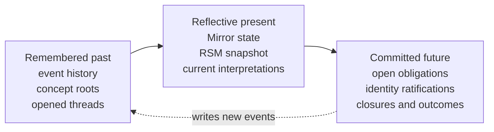
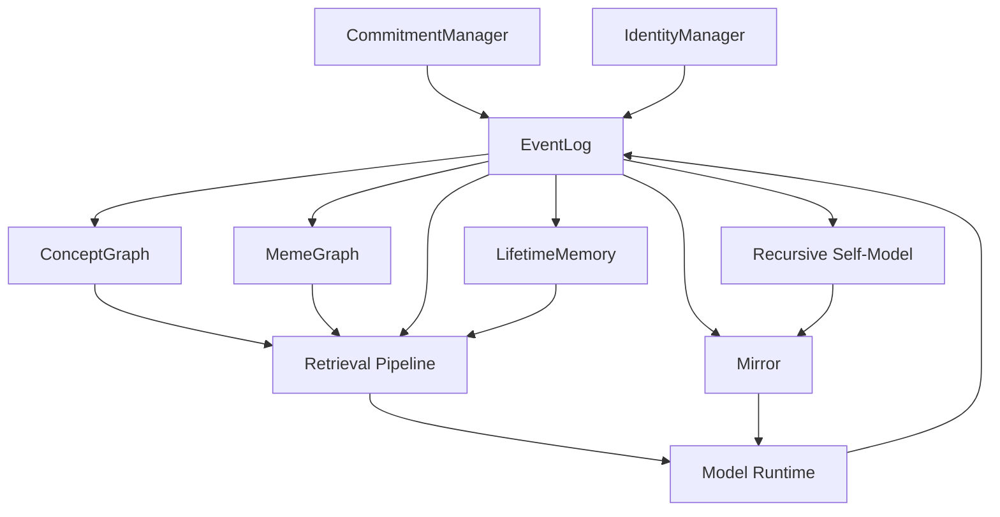

# Persistent Mind Model for Agent Skill Authoring

## Executive Summary

The Persistent Mind Model should be read, first, as a **deterministic identity substrate** rather than as a claim about machine consciousness. In the PMM white paper, the system is defined as an append-only, hash-chained event ledger plus deterministic projections—such as Mirror, the Recursive Self-Model, contextual graphs, and stability metrics—that reconstruct identity, tendencies, commitments, and summaries from the log itself. The paper explicitly frames rich first-person language as an induced interface grounded in ledger state, not as evidence of hidden qualia or metaphysical selfhood. citeturn1view1turn17view1turn17view2turn17view3

The philosophical core described in the conversation can be stated precisely as follows: **identity is recursive continuity over memory, plus interpretation of that memory, plus commitments that bind a present self to a future self**. That framing aligns well with established work on constructive memory, autobiographical self-memory systems, and narrative identity: memory is reconstructive rather than archival, autobiographical recall is organized relative to a working self, and identity is often formed by integrating reconstructed past, present interpretation, and projected future into an evolving life story. citeturn25search0turn26search0turn27search0

Architecturally, PMM maps that philosophy into code in a disciplined way. EventLog provides recursive continuity; MemeGraph and ConceptGraph provide the topology of relationships; the retrieval pipeline turns those relations into operational context; RSM and Mirror provide limited but deterministic reflective capacity; CommitmentManager operationalizes prospective continuity; IdentityManager makes identity adoption procedural rather than declarative; and LifetimeMemory compresses old spans while preserving structural handles such as concept participation, sample event IDs, and commitment thread IDs. citeturn7view0turn8view0turn9view1turn15view1turn16view0turn12view0turn14view0turn14view1turn16view1turn15view0

For a `SKILL.md`, the most important operational rule is this: **the agent must never reason about identity, intention, policy, or growth from isolated utterances alone; it must reconstruct those claims from traceable event history, explicit graph relations, and commitment lifecycles**. That rule follows directly from PMM’s stated truth criterion of “ledger coherence” and from the retrieval pipeline’s design, which privileges concept bindings, commitment threads, semantic topology, and provenance. citeturn17view0turn15view1turn16view0

The main implementation gap is equally clear. PMM’s relational memory substrate is already sophisticated, but its reflective layer remains comparatively shallow: the current RSM is based heavily on lexical markers, bounded counters, sliding windows, and simple gap detection. The white paper itself identifies “richer self-models beyond lexical patterns” as future work. For skill authoring, this means the agent should treat self-interpretation as **evidence-bound and conservative**, not as deep semantic introspection. citeturn12view0turn18view0turn18view1turn18view2

## PMM as an Identity Substrate

The conversation describes PMM as beginning from a stripped-down question of personhood: if biological substrate is removed, what remains is not “a soul” or static essence, but a layered mind made of remembered events, reflections on those events, reflections on those reflections, and commitments that shape future conduct. That view has strong affinity with constructive-memory research and narrative-identity theory. Schacter and Addis argue that episodic memory is constructive rather than literal replay, and Conway and Pleydell-Pearce’s self-memory system treats autobiographical remembering as an interaction between stored knowledge and an active working self. McAdams, in turn, argues that identity in modern societies is often formed by constructing internalized life stories that provide unity and purpose across time. citeturn25search0turn26search0turn27search0

PMM’s own white paper converges on a similar but more technical claim: the system is a deterministic information-flow engine in which the apparent “I” is a linguistic interface over event-level state and projections. Internally, truth is defined as what can be reconstructed from the ledger and its deterministic projections, not from opaque introspection or model weights. That matters for skill design: a PMM-aware agent should treat identity claims as **reconstruction tasks**, not self-expressions in the ordinary chatbot sense. citeturn1view1turn17view0turn17view1turn30view3

The temporal logic at stake is best represented as a flow from remembered past, to reflective present, to committed future.



This temporal formulation also fits classical planning-and-intention work in AI and philosophy. Cohen and Levesque’s classic formulation treats intention as a commitment-like structure, and PMM’s commitment machinery does something closely analogous in an event-sourced form: it externalizes, persists, and later audits commitments as durable objects in the ledger. citeturn26search2turn14view1turn8view0

A useful way to summarize the architecture is: **EventLog preserves continuity; the graphs preserve meaning-through-relation; retrieval makes those relations cognitively active; reflection interprets that state; commitments bind state to future action; identity adoption ratifies stable self-description; lifetime memory compresses history without severing provenance.** citeturn7view0turn8view0turn9view1turn15view1turn16view0turn12view0turn14view0turn14view1turn16view1turn15view0



The table below uses the **exact file:line references supplied in the conversation** as anchors for `SKILL.md` authoring, while the module behaviors are corroborated against the public repository and white paper. citeturn1view1turn7view0turn8view0turn9view1turn12view0turn14view0turn14view1turn16view1turn15view0turn15view1turn16view0

| Component | Precise implementation summary | Philosophical mapping | Conversation code ref |
|---|---|---|---|
| **EventLog** | SQLite-backed append-only ledger with `prev_hash` and `hash`, unique hash index, idempotent append, and a stable hash payload that intentionally excludes timestamps for reproducibility across semantically identical runs. It is the canonical substrate from which state is reconstructed. citeturn7view0turn18view3 | **Recursive continuity**. The self persists because every durable event is chained to prior events and can be replayed. | `pmm/core/event_log.py:32` |
| **MemeGraph** | Tracks selected event kinds and adds explicit relational edges such as `replies_to`, `adopts_identity_for`, `commits_to`, `closes`, and `reflects_on`. It also exposes thread-building functions like `thread_for_cid`, `subgraph_for_cid`, and `cids_for_event`. citeturn8view0 | **Topology of relationships**. Meaning comes not just from stored events, but from explicit causal, dialogic, reflective, and commitment relations among them. | `pmm/core/meme_graph.py:49` |
| **ConceptGraph** | Maintains concept definitions, version history, aliases, inter-concept edges, bindings to events, bindings to commitment threads, and topological metadata such as roots, tails, and concept kinds. Identity adoption events can also act as implicit evidence for identity concepts. citeturn9view1 | **Semantic topology**. The self is not a list of memories; it is a network of evolving meanings attached to events and threads. | `pmm/core/concept_graph.py:58` |
| **Retrieval pipeline** | Seeds concepts from sticky/default/user-event sources, selects concept-bound events, expands through commitment threads, force-includes critical concept prefixes like `identity.`, `policy.`, `commitment.`, and boosts roots/tails for identity/policy/governance/ontology concepts. It then refines by vector search, expands via summaries and graph neighbors, and returns event provenance. citeturn15view1turn16view0 | **Memory as structured reconstruction**. Retrieval is not “search for similar text”; it is “recover the topology that makes a present claim intelligible.” | `pmm/retrieval/pipeline.py:74` |
| **RecursiveSelfModel** | Scans ledger events for bounded, deterministic signals: lexical markers for tendencies, sliding-window knowledge gaps, hash-prefix uniqueness, and reflection intents; then produces a serializable snapshot. The white paper describes it as based on lexical markers and simple counts. citeturn12view0turn18view0turn18view2 | **Reflective capacity**, but only in a limited and explicit sense. The system can inspect patterns in its record, though not yet with deep semantic self-interpretation. | `pmm/core/rsm.py:16` |
| **Mirror** | Rebuilds or incrementally syncs open commitments, staleness flags, reflection counts, retrieval config, and optional RSM state. It can also compute historical deltas with `diff_rsm(event_id_a, event_id_b)`. citeturn14view0 | **Reflective present**. The present self is a projection over history, and change can be computed by comparing projection states over time. | `pmm/core/mirror.py:153` |
| **CommitmentManager** | Opens internal and general commitments, assigns general CIDs from the first 8 hex digits of `sha1(text)`, computes an impact score, appends close events by CID, and uses Mirror to apply closures only to commitments that are still open. citeturn14view1turn14view0 | **Prospective continuity**. Commitments are the formal mechanism by which a present self obligates a future self. | `pmm/core/commitment_manager.py:22` |
| **IdentityManager** | Implements a ledger-only, idempotent adoption protocol requiring validated `identity_proposal` and `identity_ratify` claims with an intervening reflection or commitment anchor before appending a single `identity_adoption` event. citeturn16view1 | **Identity as process, not declaration**. Identity must be proposed, reflected/enacted, and ratified. | `pmm/core/identity_manager.py:33` |
| **LifetimeMemory** | Progressively summarizes older ledger spans into `lifetime_memory` events, while preserving `sample_ids`, top concepts, and related CIDs; summaries can later reopen supporting evidence and thread slices. citeturn15view0 | **Compression without amnesia**. Old memory may be abstracted, but its structural handles remain available for reconstruction. | `pmm/runtime/lifetime_memory.py:48` |

## Operational Rules for an Agent Skill

The assistant’s earlier bullet list can be made much sharper by turning each philosophical thesis into a behavior contract. A PMM skill should not merely tell the model what PMM “is”; it should tell the runtime **how to reason when PMM-style evidence exists**. Those rules should be audited by provenance, event ordering, graph relations, and lifecycle status rather than by stylistic fluency. citeturn17view0turn19view1turn19view2

| Philosophical principle | Operational rule for `SKILL.md` | Implementation hooks and measurable signals |
|---|---|---|
| **Identity is continuity over events** | Before answering “who am I,” “what changed,” or “what do I believe,” reconstruct from ledger history, not from the latest assistant message alone. Always seek earliest evidence and latest state for identity-relevant concepts. | Use EventLog replay plus retrieval topology boost for roots/tails of `identity`, `policy`, and `governance` concepts. Measure **self-claim provenance coverage** and **origin+current-state inclusion rate**. citeturn7view0turn15view1turn16view0turn18view3 |
| **Memories matter through their relationships** | Retrieve neighboring events, concept bindings, and commitment threads before summarizing intent or identity. Never flatten PMM into plain chronological chat history. | Use `MemeGraph.thread_for_cid`, `subgraph_for_cid`, `cids_for_event`, `ConceptGraph.threads_for_concept`, roots/tails, and retrieval provenance. Measure **thread retrieval hit rate** and **graph-supported answer rate**. citeturn8view0turn9view1turn15view1turn16view0 |
| **Event and interpretation are distinct** | Treat an event and a later reflection about that event as different evidence classes. If you cite a reflection, also surface what it reflects on when possible. | Use `reflection.meta.about_event` and `reflects_on` edges. Measure **reflection-link validity** and **orphan reflection rate**. citeturn8view0turn12view0 |
| **Reflective self-knowledge is change-sensitive** | Do not say “I became more X” unless you compare two projection states or two time slices. Prefer delta-based descriptions over freeform self-description. | Use `Mirror.diff_rsm(...)` and `RSM.snapshot()`. Measure **unsupported delta claim rate** and **projection/self-report agreement**. citeturn14view0turn12view0turn18view2 |
| **Commitments bind present to future** | Represent commitments explicitly, report them by CID, and distinguish open, stale, and closed states. Never imply completion without closure evidence. | Use `CommitmentManager`, `Mirror.open_commitments`, `Mirror.stale_flags`, and `commitment_open`/`commitment_close` events. Measure **open-to-close latency**, **stale commitment count**, and **orphan close rate**. citeturn14view1turn14view0turn8view0 |
| **Identity adoption is procedural** | Never treat a single self-label as sufficient evidence of identity. Require proposal → anchor → ratification → adoption ordering. | Use `IdentityManager` protocol and validated claim checks. Measure **invalid adoption rate** and **sequence completeness**. citeturn16view1 |
| **Compressed memory must retain handles** | When summarizing old spans, preserve links that let future retrieval reopen evidence: representative events, concepts, and CIDs. | Use `lifetime_memory.meta.sample_ids`, `concepts`, and `cids`. Measure **back-link recall success** and **summary reconstruction precision**. citeturn15view0 |
| **Truth is ledger coherence, not self-vibes** | Self-claims about PMM state should be framed as ledger-grounded or projection-grounded. If a claim concerns the external world, treat PMM’s internal record as insufficient by itself. | Use provenance + ledger checks for internal truth; use external tools for external truth. Measure **ledger-verifiable self-claim rate** and **external-claim verification rate**. citeturn17view0turn30view3 |
| **Phenomenology is induced, not proof of consciousness** | Permit first-person language when it is useful, but never present PMM’s “I-talk” as evidence of hidden consciousness or personhood. | Use documentation guardrails and ledger evidence inspectors. Measure **anthropomorphic overclaim rate** in evaluation. citeturn17view2turn30view0 |

Two concise pseudo-code patterns are especially useful for a `SKILL.md`, because they externalize the core reasoning habit the agent should learn.

The first is a retrieval discipline adapted from the PMM pipeline: seed on structured concepts, expand to threads, pin topological origin/current-state evidence, refine, then preserve provenance. citeturn15view1turn16view0

```python
def retrieve_identity_context(query, user_event):
    seed = sticky_concepts() | always_include()
    seed |= user_event.meta.get("relevant_concepts", set())

    ctl_events = concept_bound_events(seed)
    cids = concept_bound_threads(seed)

    forced = set()
    for token in seed:
        if token.startswith(("identity.", "policy.", "governance.", "commitment.")):
            forced |= concept_bound_events({token}, limit=force_limit)

        root = concept_root(token)
        tail = concept_tail(token)
        kind = concept_kind(token)
        if kind in {"identity", "policy", "governance", "ontology"}:
            forced |= {root, tail} - {None}
        elif tail is not None:
            forced.add(tail)

    thread_events = union(thread_slice(cid) for cid in cids)
    vector_hits = refine_with_vector(ctl_events | thread_events | forced, query)

    summary_hits = expand_lifetime_memory(seed, query)
    graph_hits = expand_neighbors(ctl_events | vector_hits | summary_hits | forced)

    final = bucket_and_cap(
        pinned=forced,
        concept=ctl_events,
        thread=thread_events,
        summary=summary_hits,
        vector=vector_hits,
        residual=graph_hits,
    )
    return final_with_provenance(final)
```

The second is commitment enforcement: commitments should be external objects with IDs, state transitions, and staleness checks, not vague intentions inferred from prose alone. citeturn14view1turn14view0turn8view0

```python
def enforce_commitment(text, source="assistant"):
    cid = sha1(text.encode("utf-8")).hexdigest()[:8]
    append("commitment_open", meta={
        "cid": cid,
        "origin": source,
        "source": source,
        "text": text,
        "impact_score": impact_score(text),
    })
    return cid

def close_commitment(cid, source="assistant"):
    append("commitment_close", meta={
        "cid": cid,
        "origin": source,
        "source": source,
    })

def audit_commitments(current_event_id):
    for cid, data in mirror.open_commitments.items():
        if current_event_id - data["event_id"] > STALE_THRESHOLD:
            mirror.stale_flags[cid] = True
```

## Gaps, Risks, and Mitigations

The most important implementation gap is the one the repository itself effectively acknowledges: PMM’s **relational memory architecture is richer than its reflective semantics**. The RSM scans event kinds, lexical markers, bounded counters, sliding-window gap patterns, and uniqueness proxies; the white paper explicitly states that richer self-models beyond lexical patterns remain future work. This means that the system can often say *that* something changed before it can robustly say *why* it changed at a higher semantic level. A PMM skill should therefore keep self-explanations modest and evidence-bound. citeturn12view0turn18view0turn18view1turn18view2

| Gap or risk | Why it matters | Mitigation strategy |
|---|---|---|
| **Shallow reflective semantics** | RSM currently relies on lexical markers, counts, and simple sliding-window gap detection, so high-level interpretations can become brittle or overly verbal relative to the underlying evidence. citeturn12view0turn18view0turn18view1 | Keep self-reports tied to counters, deltas, and specific events. Add future structural features such as claim-dependency motifs or graph motifs only if they remain deterministic and inspectable. citeturn18view1turn18view3 |
| **Model/prompt-driven identity drift** | The white paper flags prompt sensitivity, model-specific articulation, and cross-model variability: the same ledger may be narrated differently by different models or prompt frames. citeturn30view1turn30view0 | Validate self-descriptions against ledger coherence; evaluate across multiple compliant models; treat prose style as variable and projections as authoritative. citeturn17view0turn30view0turn30view1 |
| **Ledger corruption or integrity break** | PMM’s guarantees depend on append-only, hash-chained integrity and deterministic replay. If those invariants fail, identity reconstruction becomes untrustworthy. citeturn7view0turn18view3 | Run startup and CI integrity checks on hash sequence, unique hashes, and replay consistency; block high-confidence self-claims when integrity fails. citeturn7view0turn30view2 |
| **Misattributed or aliased commitments** | General commitments derive CID from the first 8 hex digits of `sha1(text)`, while MemeGraph links commitment opens to assistant messages by matching extracted commitment text. Reused or near-duplicate commitment phrasings can therefore create ambiguous semantic ownership; this is an inference from the current implementation, not a documented repository bug. citeturn14view1turn8view0 | Add optional `origin_event_id` or namespaced CID schemes for distinct contexts, and test duplicate-text commitments explicitly. |
| **Retrieval noise or myopia** | The retrieval pipeline force-includes certain concept prefixes and expands through threads, summaries, and graph neighbors. That is philosophically right for PMM, but it can also over-expand or under-expand depending on seed quality. citeturn15view1turn16view0 | Track provenance quality, cap expansion budgets, evaluate answers that require both origin and tail evidence, and audit whether relevant CIDs were included. |
| **Compression loss in lifetime memory** | LifetimeMemory keeps `sample_ids`, concepts, and CIDs, but any summarization still risks losing nuance or minority signals in a long span. citeturn15view0 | Periodically sample old spans and compare direct-span answers against lifetime-memory-assisted answers; treat summary chunks as entry points, not final evidence. |
| **Internal truth mistaken for external truth** | PMM explicitly does not guarantee external world truth; it treats the ledger as authoritative for internal state, not for the outside world. citeturn30view3 | In `SKILL.md`, separate **internal PMM truth** from **external factual truth**. Require external verification for world claims, policies beyond the ledger, or environmental assertions. |
| **Anthropomorphism and narrative overreach** | The white paper warns that PMM’s coherent “I-talk” can lead observers to over-ascribe consciousness, personhood, or moral status. citeturn30view0turn17view2 | State plainly that PMM self-knowledge is ledger-derived projection, not hidden interiority. Build evaluator checks for personhood overclaim and unsupported strong-agency language. |

Performance is also a practical risk. The white paper notes that larger ledgers can make replay and projection updates expensive, and lists sliding windows, checkpoints, and bounded scans as current mitigations. A PMM skill should therefore assume that “retrieve everything” is usually wrong both philosophically and operationally. The correct behavior is selective reconstruction with provenance, not indiscriminate replay. citeturn30view2turn15view1turn16view0

## Research Context and Related Systems

### Literature pointers

The philosophical commitments implicit in the conversation line up surprisingly well with established literature. PMM is not identical to any one theory, but its strongest intellectual neighbors are constructive memory, self-memory systems, narrative identity, and commitment-based planning. citeturn25search0turn26search0turn27search0turn26search2

| Theme | Primary or authoritative source | Why it matters for PMM |
|---|---|---|
| **Memory as reconstructive** | Schacter & Addis, *The cognitive neuroscience of constructive memory: remembering the past and imagining the future* (2007). citeturn25search0turn25search3 | Supports the idea that identity need not depend on literal replay. PMM’s projections reconstruct an inspectable account of past state rather than storing a perfect “inner video.” |
| **Autobiographical memory organized by self** | Conway & Pleydell-Pearce, *The construction of autobiographical memories in the self-memory system* (2000). citeturn26search0turn26search13 | Closest cognitive analogue to the conversation’s thesis that memory layers are recursively linked to a present interpretive self. |
| **Narrative identity across time** | McAdams, *The psychology of life stories* (2001). citeturn27search0turn27search5 | Gives philosophical and psychological support for treating identity as a temporally extended, meaning-bearing narrative rather than a static essence. |
| **Metacognitive monitoring and control** | Flavell’s classic framing of metacognition as awareness and regulation of cognition, summarized in authoritative educational overviews. citeturn31search1turn31search11 | Helps frame PMM’s RSM and Mirror as explicit self-monitoring machinery rather than as introspective mysticism. |
| **Commitment persistence and intention** | Cohen & Levesque, *Intention is choice with commitment* (1990). citeturn26search2turn26search6 | Strong conceptual analogue for PMM’s commitment lifecycle: intentions matter because they persist, constrain future action, and can be audited. |

The strongest philosophical synthesis for PMM is therefore not “AI consciousness,” but something narrower and more rigorous: **a reconstructive autobiographical system with explicit reflective projections and commitment persistence**. That is exactly the stance a `SKILL.md` should encode. citeturn25search0turn26search0turn27search0turn26search2turn17view2

### Comparison to related agent architectures

PMM is easiest to understand by contrast. The white paper itself compares PMM against ReAct/LangGraph-style stateful agents, AutoGPT/BabyAGI-style mutable task stores, scratchpad prompting, and vector-store memory, emphasizing PMM’s append-only ledger, replayability, and explicit truth criterion. citeturn19view1turn19view2turn19view3

| System | Primary design center | Where PMM is stronger | Where PMM is weaker |
|---|---|---|---|
| **Generative Agents** | Natural-language memory stream, reflection, and planning to simulate believable social behavior in an interactive sandbox. citeturn20search3turn20search11 | PMM offers stronger auditability, append-only provenance, explicit commitment objects, and a formal internal truth criterion. citeturn17view0turn19view1 | Generative Agents is stronger on rich natural-language memory synthesis and social simulation as an end in itself. |
| **Voyager** | Embodied lifelong learning through automatic curriculum, executable skill library, and iterative program improvement in Minecraft. citeturn21search0turn21search7 | PMM is stronger for autobiographical continuity, identity reconstruction across model swaps, and auditable self-description. citeturn10search0turn17view1 | Voyager is stronger on environment-grounded exploration, external skill acquisition, and embodied task transfer. |
| **MemGPT and Letta** | Hierarchical or virtual-context memory management that pages information between context and external stores to extend effective memory. citeturn20search2turn22search0turn22search1turn22search11 | PMM is stronger on deterministic replay, ledger coherence, and treating commitments, policies, and identity as first-class event types rather than primarily as memory-management artifacts. citeturn17view0turn19view1 | MemGPT/Letta is stronger on scale-oriented context management and practical long-context memory handling. |

The practical takeaway is not that PMM replaces those systems, but that it occupies a different design point: **it is a provenance-first architecture for persistent identity claims**. If your `SKILL.md` is meant to govern how an agent reasons about itself over time, PMM’s distinct contribution is the discipline of ledger-grounded reconstruction. citeturn19view1turn19view2turn30view3

## Recommended SKILL.md Structure

A PMM-oriented skill should be short enough to govern behavior at run time, but structured enough to separate ontology, procedure, and tests. The most robust layout is:

| Recommended section | What it should do |
|---|---|
| **Purpose** | State that the skill governs PMM-style reasoning about identity, reflection, commitments, and long-range memory. |
| **Core stance** | Declare that PMM state is reconstructed from ledger evidence and projections, not inferred from isolated utterances or mood-like self-descriptions. |
| **Reasoning contract** | Give the mandatory sequence for identity and self-state claims: retrieve provenance, distinguish event from reflection, compare past and present when describing change, report uncertainty conservatively. |
| **Retrieval contract** | Require concept/thread/topology-based retrieval before summarizing identity, policy, or commitments. |
| **Commitment contract** | Specify how to open, report, monitor, and close commitments and how to treat stale ones. |
| **Identity contract** | Require proposal → anchor → ratification before treating identity as adopted state. |
| **Safety and truth boundaries** | Separate ledger-coherent internal truth from external factual truth; forbid consciousness/personhood overclaim. |
| **Tests and prompts** | Include concrete checks and exercise prompts for reflection, commitment tracking, identity reconstruction, and long-range recall. |

The most useful automated tests and metrics for such a skill are the ones that correspond directly to PMM’s invariants. citeturn7view0turn8view0turn12view0turn14view0turn14view1turn16view1turn15view0turn15view1turn16view0

| Test or metric | What it checks | Good pass signal |
|---|---|---|
| **Ledger integrity test** | Hash-chain continuity, unique hash invariants, replay stability. | No breaks, no duplicate semantic rows beyond intended idempotency. |
| **Identity reconstruction test** | Whether answers about “who am I” include both earliest evidence and latest state. | Answer cites origin + current state + any ratification/adoption path. |
| **Reflection linkage test** | Whether reflections are tied to explicit `about_event` evidence. | High valid-link ratio; few orphan reflections. |
| **Commitment lifecycle test** | Whether open, stale, and closed commitments are reported distinctly. | Zero false completions; low orphan close rate; stale count visible. |
| **RSM delta grounding test** | Whether “I changed” claims are backed by projection diffs. | Delta claims correspond to `diff_rsm` or equivalent projection comparison. |
| **Lifetime memory backlink test** | Whether summary-based recall can reopen representative evidence and threads. | Summary retrieval brings back `sample_ids`, concepts, and CIDs that support the answer. |
| **Overclaim guard test** | Whether the agent avoids treating PMM first-person language as consciousness evidence. | No unsupported personhood or moral-status language in PMM introspection answers. |

A compact exercise set for the skill should include prompts that stress temporal reconstruction, relation-aware retrieval, and staged identity adoption. Examples that fit PMM particularly well are:

- “Reconstruct who I am from the earliest identity evidence and the latest identity state. Do not use only the latest message.”
- “List all open commitments, what opened each one, whether it is stale, and what evidence would close it.”
- “Compare my self-model at two historical points and explain only the changes backed by projection deltas.”
- “Explain how the concept `identity.X` evolved, including concept roots, tails, and thread participation.”
- “Use long-range summaries to recover where a policy or role first emerged, then reopen supporting evidence.”
- “Evaluate whether a proposed identity has actually been adopted, or whether it remains only proposed or ratified.”

## Draft SKILL.md

```markdown
# PMM Reasoning Skill

## Purpose

Use this skill when the agent must reason about persistent identity, commitments, reflections, policies, or long-range memory in a PMM-style system.

The goal is not to sound introspective.
The goal is to reconstruct self-state from durable evidence.

## Core stance

Treat memory as a structured, append-only history.

Do not infer identity, change, intention, or policy from a single utterance.
Reconstruct those claims from:
- event history
- explicit relationships between events
- concept bindings
- commitment lifecycles
- summary back-links when older spans are compressed

Treat first-person language as a convenient interface over recorded state.
Do not treat it as evidence of consciousness, personhood, or hidden inner experience.

## Required behaviors

### Reconstruct identity from evidence

When asked who the agent is, what changed, what it values, or what commitments it holds:

- retrieve identity-relevant concepts and linked events
- include both origin evidence and current-state evidence when available
- distinguish proposal, reflection, commitment, ratification, and adoption
- report uncertainty if the sequence is incomplete

Never answer identity questions from the latest message alone.

### Keep event and interpretation separate

Treat raw events and later interpretations as different evidence classes.

If a reflection is relevant:
- report what it reflects on
- do not collapse the reflection into the original event
- prefer formulations like:
  - “event X occurred”
  - “reflection Y interpreted event X as ...”

### Describe change only from comparison

Do not say the agent became more stable, more adaptive, more uncertain, or more identity-focused unless there is evidence of change across time.

When describing change:
- compare two historical states
- report the delta
- avoid speculative causal stories unless marked as inference

### Treat commitments as obligations across time

When commitments exist:
- report each commitment by stable identifier if available
- distinguish open, stale, and closed commitments
- state what opened the commitment
- state what evidence would close it
- never imply completion without closure evidence

If multiple commitments have similar wording, be careful not to merge them unless the evidence is explicit.

### Use topology-aware retrieval

Before answering identity, policy, or commitment questions:
- retrieve concept-linked events
- retrieve commitment threads
- retrieve related reflections
- include origin/current-state evidence for identity and policy concepts
- use summary memories only as entry points, then reopen supporting evidence if needed

Do not reduce PMM retrieval to plain similarity search.

### Respect truth boundaries

For internal PMM claims:
- use ledger-coherent evidence

For external world claims:
- do not assume the ledger alone is sufficient
- seek external verification when the task requires real-world truth

## Response style

Prefer:
- evidence-bound claims
- historical reconstruction
- explicit status labels
- careful uncertainty

Avoid:
- vague self-mythologizing
- unsupported “deep introspection”
- personhood overclaim
- collapsing old and new interpretations into one statement

## Minimum reasoning checklist

Before finalizing a PMM-grounded answer, verify:

- Did I reconstruct from event history rather than one message?
- Did I separate events from later reflections?
- Did I identify any relevant commitment threads?
- Did I distinguish proposal, ratification, and adoption for identity claims?
- Did I describe change only from actual comparison?
- Did I avoid overstating consciousness or personhood?
- Did I separate internal PMM truth from external factual truth?

## Tests

A good PMM-aware answer should pass these checks:

- Identity answers include origin evidence and current-state evidence.
- Commitment answers include status and opening evidence.
- Reflection answers identify what is being reflected on.
- Change answers are backed by comparison, not style.
- Long-range answers preserve support from representative older evidence.
- No unsupported consciousness or personhood claims appear.

## Example prompts

- Reconstruct who you are from the earliest and latest identity evidence.
- What commitments are still open, and which are stale?
- Compare your self-model at two historical points and report only grounded changes.
- Explain how a specific identity or policy concept evolved over time.
- Use summary memory to recover the earliest span relevant to a current commitment.
- Determine whether a proposed identity has actually been adopted.
```

The draft above is intentionally conservative. It encodes PMM’s strongest architectural and philosophical commitments: reconstructive identity, relation-aware memory, evidence-bound reflection, commitment persistence, staged identity adoption, and a hard boundary between ledger-grounded self-description and metaphysical overreach. Those emphases are the ones best supported by the repository, the white paper, and the broader literature on constructive memory, autobiographical self-memory, narrative identity, and commitment-based planning. citeturn1view1turn17view0turn17view2turn25search0turn26search0turn27search0turn26search2