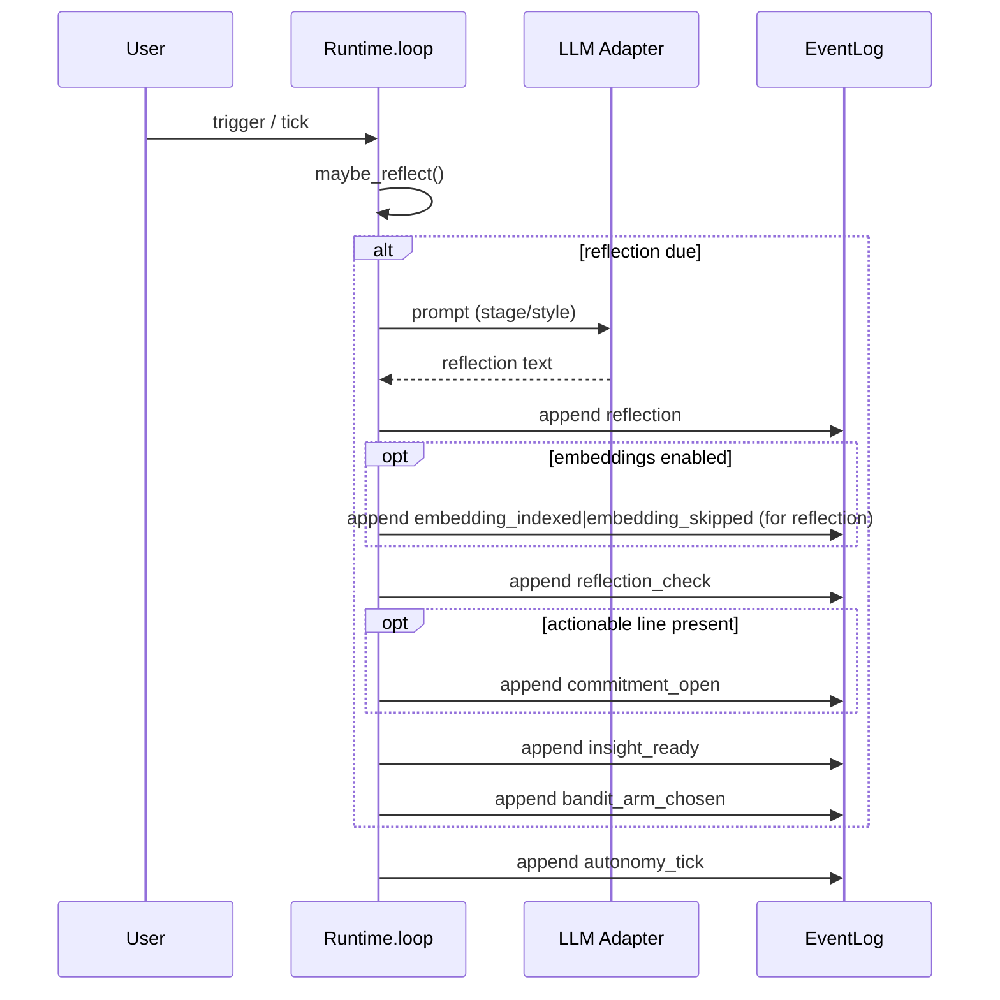

# Reflection Flow (Clean‑Slate PMM)

This document captures the authoritative event ordering for the reflection path in the clean‑slate runtime. It is grounded in the current implementation of `pmm/runtime/loop.py` and is intended to be stable for tests.

- Key modules and functions:
  - `pmm/runtime/loop.py: Runtime.reflect()`
  - `pmm/runtime/loop.py: emit_reflection()`
  - `pmm/runtime/loop.py: _append_reflection_check()`
  - `pmm/runtime/loop.py: maybe_reflect()`
  - `pmm/runtime/loop.py: AutonomyLoop.tick()`

## Sequence Diagram

## Bullet Timeline

- Embeddings OFF:
  - `reflection` → `reflection_check` → `[commitment_open?]` → `insight_ready` → `bandit_arm_chosen` → `autonomy_tick`

- Embeddings ON:
  - `reflection` → `embedding_indexed|embedding_skipped` → `reflection_check` → `[commitment_open?]` → `insight_ready` → `bandit_arm_chosen` → `autonomy_tick`

## Notes and Citations

- Reflection append points:
  - `Runtime.reflect()` appends `reflection` then `_append_reflection_check()` and optionally `commitment_open` (see `pmm/runtime/loop.py` around lines 391–456).
  - `emit_reflection()` appends `reflection`, then `_append_reflection_check()`, then optionally `commitment_open` (see `pmm/runtime/loop.py` around lines 602–667).
- Bandit logging:
  - `maybe_reflect()` and `AutonomyLoop.tick()` append `bandit_arm_chosen` after a reflection (see `pmm/runtime/loop.py` around lines 670–721 and 1011–1017).
- Insight signal:
  - `AutonomyLoop.tick()` may append `insight_ready` once per reflection when voicable and unanswered (see `pmm/runtime/loop.py` around lines 922–956 and 997–1010).
- Autonomy heartbeat:
  - `AutonomyLoop.tick()` appends `autonomy_tick` at the end of each tick (see `pmm/runtime/loop.py` around lines 1715–1724).
- Embedding events (if enabled):
  - For reflections, indexing occurs immediately after the content event they describe (see `_index_embedding_async` at lines 75–95, and response path for the same pattern at lines 208–287).

## Test‑Sensitive Ordering

The following tests rely on this ordering:
- `tests/test_reflection_commitment_due.py`
- `tests/test_reflection_cadence.py`
- `tests/test_reflection_bandit.py`
- `tests/test_reflection_runtime.py`

No changes should be made that reorder these event sequences without updating the tests accordingly.

## Observability Hooks

Reflection invokes the LLM via budgeted wrappers that emit diagnostic breadcrumbs:

- `llm_latency` — per-call latency with `{ op, provider, model, ms, ok, tick }`.
- `rate_limit_skip` — emitted when a per-tick ceiling would be exceeded; runtime falls back deterministically.

For details on budgets, event fields, and where they are wired, see:

- [Observability: LLM Budgets and Latency Events](../guide/observability.md)
